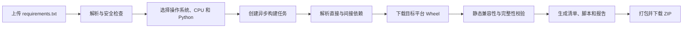
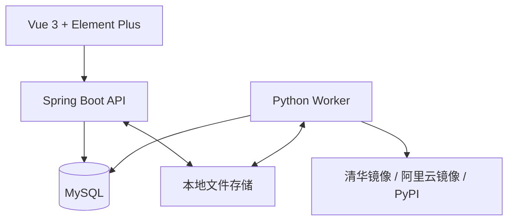

# WheelForge

多架构 Python 离线依赖构建平台。

WheelForge 根据用户上传的 `requirements.txt`，以及所选的目标操作系统、CPU 架构和 Python 版本，重新解析并下载相匹配的 Wheel，完成静态校验后生成可交付的离线 ZIP 包。

> WheelForge 不会把 Windows x86_64 上已经安装的二进制包直接“转换”为 ARM 包。它会从受信任的软件源重新查找目标平台已有的 Wheel，并重新构建完整依赖集合。

## 核心流程



## 已实现能力

- 上传并解析 UTF-8、UTF-8 BOM 或 GBK 编码的 `requirements.txt`，兼容 LF 与 CRLF。
- 支持常见版本约束、extras 和 Python Marker，识别重复依赖、冲突与不支持语法。
- 按目标操作系统、CPU 架构、CPython 版本、ABI 和平台标签解析直接及间接依赖。
- 只下载 Wheel，不接受源码包；下载源按清华镜像、阿里云镜像、PyPI 顺序自动回退。
- 兼容求解允许在目标平台缺少原版本 Wheel 时升级或降级，并展示版本变化、变化方向和原因。
- 校验 Wheel 文件名标签、`METADATA`、`WHEEL`、`RECORD`、依赖闭包、校验和及 ZIP 路径安全。
- 提供异步任务队列、实时日志、取消、重试、历史记录、下载统计和过期清理。
- 提供普通用户和管理员权限；管理员可管理用户、内置下载源状态及系统限制。
- 使用 MySQL 租约队列协调 Worker，支持任务接管与并发所有者隔离。

## 目标平台

V1 提供 20 个静态校验目标组合：

| 操作系统 | CPU 架构 | Python | 平台标签 |
| --- | --- | --- | --- |
| Linux | x86_64 | 3.9、3.10、3.11、3.12、3.13 | `manylinux2014_x86_64` |
| Linux | ARM64 | 3.9、3.10、3.11、3.12、3.13 | `manylinux2014_aarch64` |
| Windows | x64 / AMD64 | 3.9、3.10、3.11、3.12、3.13 | `win_amd64` |
| Windows | ARM64 | 3.9、3.10、3.11、3.12、3.13 | `win_arm64` |

纯 Python 通用包（如 `py3-none-any`）也可进入对应目标的离线包。

## 架构



| 模块 | 技术与职责 |
| --- | --- |
| `frontend` | Vue 3、TypeScript、Element Plus；构建、任务、产物与管理界面 |
| `backend` | Java 21、Spring Boot、Flyway；认证、API、任务与下载管理 |
| `worker` | Python 3.12；依赖求解、Wheel 下载、校验与打包 |
| MySQL | 业务数据、构建队列、租约和配置 |
| 本地文件系统 | 上传文件、工作目录和最终构建产物 |

V1 不依赖 Docker、Redis、MinIO 或虚拟机镜像。

## 快速开始

### 环境要求

- Java 21
- Python 3.12
- MySQL 8.4 或更高版本
- Node.js 24 与 npm
- `make` 和 POSIX Shell

### 1. 安装依赖

```sh
./mvnw -q -pl backend dependency:go-offline

python3.12 -m venv worker/.venv
worker/.venv/bin/python -m pip install --upgrade pip
cd worker
.venv/bin/python -m pip install -e '.[dev]'
cd ..

npm --prefix frontend ci
```

### 2. 配置 MySQL 与环境变量

先按照 [开发文档](docs/development.md#mysql-setup) 创建 `wheelforge` 数据库和专用用户，然后生成本地环境文件：

```sh
cp deploy/.env.example .env
```

编辑 `.env`，至少替换以下内容：

- MySQL JDBC URL、SQLAlchemy URL、用户名和密码。
- 长度不少于 32 字节的 `WF_AUTH_TOKEN_SECRET`。
- 首个管理员账号与强密码。
- 两个互不相同的绝对路径：`WF_DATA_ROOT` 和 `WF_WORKSPACE_ROOT`。

创建上述数据与工作目录，并确保 API 和 Worker 对它们拥有读写权限。仅用于受信任的单用户本地开发环境时，可按[开发文档](docs/development.md#environment-and-local-roots)启用 portable storage；生产环境应保持关闭。

### 3. 启动服务

先在每个终端载入环境变量：

```sh
set -a
. ./.env
set +a
```

依次启动 API、初始化目标平台、启动 Worker 和前端：

```sh
# 终端 1：API（首次启动时由 Flyway 创建表）
./mvnw -q -pl backend spring-boot:run

# 终端 2：首次运行一次，写入 20 个 V1 目标平台
./scripts/bootstrap-target-profiles.sh

# 终端 2：Worker
worker/.venv/bin/python -m wheelforge_worker

# 终端 3：前端
npm --prefix frontend run dev
```

打开 `http://localhost:5173`。Vite 会把 `/api` 和 `/actuator` 请求代理到 `http://localhost:8080`。

生产环境的目录权限、systemd 服务、备份恢复和凭据轮换请参阅[原生部署与运维指南](docs/operations.md)。

## 构建产物

成功构建的 ZIP 包包含：

```text
README.md
requirements-original.txt
requirements-resolved.txt
install.sh
verify.sh
manifest.json
checksums.sha256
build-report.html
version-comparison.csv
packages/
  *.whl
```

Linux 目标生成 `install.sh` 与 `verify.sh`；Windows 目标则生成对应的 `install.bat` 与 `verify.bat`。

其中 `version-comparison.csv` 和网页中的对比表会标明依赖版本是升级、降级还是保持不变，便于评估兼容求解带来的变化。

## 验证

运行不依赖数据库的后端、Worker 和前端检查：

```sh
make verify
```

运行前端端到端测试：

```sh
npm --prefix frontend run test:e2e
```

MySQL 迁移与队列集成测试需要显式指定一次性测试数据库，命令和安全要求见[开发文档](docs/development.md#verification)。完整 V1 范围及对应测试证据见[验收矩阵](docs/v1-acceptance.md)。

## 重要边界

- **静态验证**：平台不会在目标 ARM 或 Windows 环境中实际安装或导入依赖。构建成功表示 Wheel 标签、元数据、哈希与依赖闭包通过静态检查，不等同于目标机器上的运行保证。
- **目标平台必须有 Wheel**：如果软件源没有满足目标操作系统、CPU、Python 和 ABI 的 Wheel，系统无法凭空生成二进制包，任务会失败或产生明确标记为不可安装的部分成功产物。
- **兼容求解可能升降版本**：系统会围绕原始约束寻找可用组合，版本既可能高于也可能低于原锁定版本；所有变化都会写入比较表与构建报告。
- **不执行依赖代码**：校验阶段不会导入或执行下载到的第三方包。
- **软件源受控**：V1 只允许内置清华、阿里云和 PyPI 源，不接受用户提交任意下载 URL。

V1 暂不支持源码编译、Git/VCS 依赖、editable 安装、本地路径、URL 依赖、macOS、Conda、Poetry、私有 PyPI、CUDA 专用源、一次构建多个目标平台或 Docker/OCI 镜像输出。

## 项目结构

```text
backend/             Spring Boot API 与数据库迁移
worker/              Python 构建 Worker
frontend/            Vue 3 Web 界面
contracts/           API 与任务载荷契约
integration-tests/   跨模块集成测试
scripts/             初始化和发布辅助脚本
deploy/              systemd、环境模板与冒烟检查
docs/                开发、运维与验收文档
```

## 文档

- [开发与本地验证](docs/development.md)
- [原生部署与运维](docs/operations.md)
- [V1 验收矩阵](docs/v1-acceptance.md)
