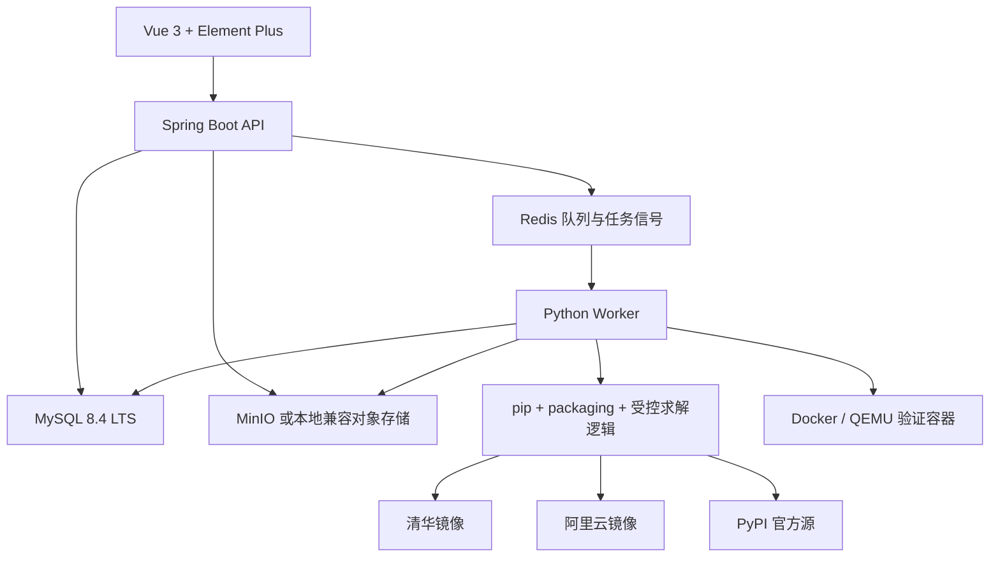
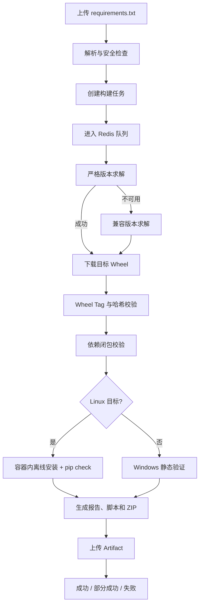

# WheelForge 后端与 Python Worker 设计

日期：2026-07-22

状态：已完成方案讨论，待设计文档确认
范围：V1 后端、任务调度、Python Worker、依赖产物与验证

## 1. 项目概述

WheelForge 是一个多操作系统、多 CPU 架构的 Python 离线依赖构建平台。用户上传已经在开发环境中使用的 `requirements.txt`，选择目标操作系统、CPU 架构和 Python 版本，系统针对目标环境重新解析依赖、下载兼容 Wheel、验证依赖完整性并生成可交付的离线 ZIP。

典型场景是：用户在家中的 Windows x86_64 电脑上运行并验证了一个 Python 项目，但项目需要部署到公司内网中的国产 Linux ARM64 电脑。用户无法直接复用 Windows x86_64 原生 Wheel，也不希望在公司环境重新联网下载，因此使用 WheelForge 为 Linux ARM64 重新构建依赖包。

WheelForge 不进行 x86 Wheel 到 ARM Wheel 的二进制转换。它根据原始依赖约束，从受信任的软件源重新求解并下载目标平台已有的 Wheel。纯 Python 的 `py3-none-any` Wheel 可以跨平台复用；包含本地二进制扩展的包必须存在对应目标平台的 Wheel。

## 2. 产品定位与目标

WheelForge 不是 Python 包管理器、Python 解释器、IDE、Docker 镜像构建工具或源码编译平台。它负责将已有 Python 依赖描述转换为目标环境可离线交付的标准化 Wheel 集合。

V1 目标：

- 用户无需掌握复杂的 `pip` 跨平台参数。
- 支持 Linux x86_64、Linux ARM64、Windows x64 和 Windows ARM64。
- 支持 Python 3.9、3.10、3.11、3.12 和 3.13。
- V1 的 Python 实现限定为 CPython。
- 解析直接依赖和间接依赖。
- 只允许 Wheel，不下载或编译源码包。
- 原始版本不可用时，在兼容范围内自动寻找最接近的更高或更低版本。
- 清晰展示原始约束与最终版本之间的变化。
- 生成安装脚本、校验脚本、依赖清单、构建报告、哈希文件和 ZIP。
- 支持异步队列、日志、取消、重试、历史记录和下载管理。

V1 不包含：

- macOS。
- 源码包编译。
- Git、URL、本地路径和 editable 依赖。
- Conda、Poetry 和私有 PyPI。
- Nexus、Artifactory 和企业代理仓库。
- CUDA 专用源。
- 单任务同时生成多个目标平台。
- Docker 镜像或 OCI Registry 输出。
- 大模型参与核心依赖解析或下载。

## 3. 已确认的产品决策

| 决策项 | V1 结论 |
| --- | --- |
| 实现范围 | 后端和 Python Worker 核心能力 |
| 首要目标平台 | 国产 Linux ARM64 |
| 其他目标平台 | Linux x86_64、Windows x64、Windows ARM64 |
| Linux 验证 | 对目标架构执行真实离线安装和 `pip check` |
| Windows 验证 | V1 仅执行静态验证，明确展示验证等级 |
| 版本策略 | 默认允许兼容求解，原版本优先，可就近升级或降级 |
| 兼容边界 | 不跨稳定版本的主版本；`0.x` 默认限制在同一 minor |
| 源码构建 | 禁止；缺少 Wheel 时报告部分成功或失败 |
| 下载源 | 清华、阿里云、PyPI 官方源白名单，自动切换 |
| 部署形式 | V1 可在单机部署，组件可在后续横向扩展 |
| 关系型数据库 | MySQL 8.4 LTS，使用 InnoDB 和 `utf8mb4` |
| 用户体系 | 普通用户资源隔离，管理员可查看全局任务和配置 |
| 任务取消 | 支持取消排队和运行中的任务 |
| 大模型 | 不进入 V1 核心链路，未来仅考虑辅助诊断 |
| Python 选择 | CPython 3.9 至 3.13 的主次版本为任务必填约束 |

V1 目标环境映射：

| 用户选择 | Worker 平台选择器 | 主要允许的平台 Tag |
| --- | --- | --- |
| Linux x86_64 | `linux / x86_64` | `manylinux2014_x86_64`、兼容的 `manylinux` Tag、`py3-none-any` |
| Linux ARM64 | `linux / aarch64` | `manylinux2014_aarch64`、兼容的 `manylinux` Tag、`py3-none-any` |
| Windows x64 | `windows / AMD64` | `win_amd64`、`py3-none-any` |
| Windows ARM64 | `windows / ARM64` | `win_arm64`、`py3-none-any` |

Linux V1 默认兼容基线为 `manylinux2014`。`manylinux_2_28` 作为后续可配置基线，不在首个交付版本中开放。

### 3.1 目标 Python 约束

每个构建任务只对应一个确定的目标环境：

```text
操作系统 + CPU 架构 + Python 实现 + Python 主次版本 + ABI + 平台兼容基线
```

例如：

```text
Linux + ARM64 + CPython + 3.11 + cp311/abi3/none + manylinux2014
```

操作系统、CPU 架构和 CPython 主次版本是创建任务时的必填参数。任务创建后这些字段不可修改；用户需要更换任一目标参数时，应创建新任务。

用户在 V1 选择 `3.9` 至 `3.13` 的主次版本，不直接选择补丁版本。系统维护平台能力表，为每个开放组合绑定经过验证的具体 CPython 补丁版本、容器镜像摘要、支持的 ABI 和验证能力。该补丁版本写入 Manifest 和构建报告，确保构建过程可复现。

平台能力表决定哪些组合可以创建任务。前端只能展示已启用组合，API 仍需独立校验，不能假设四种操作系统和架构组合与五个 Python 版本一定全部可用。

自动兼容求解只能调整依赖包版本，不能修改用户选择的 Python 版本。例如目标为 CPython 3.11，而某个包只有 CPython 3.10 的 ARM64 Wheel 时，系统应继续搜索支持 3.11 的包版本；仍然找不到时报告缺失，不能把任务改为 Python 3.10。

## 4. 总体架构



### 4.1 Spring Boot API 职责

- 用户认证、权限和资源归属。
- Requirements 文件上传和元数据管理。
- 构建任务创建、查询、取消、重试和删除。
- Redis 队列投递与任务状态管理。
- 构建日志、解析结果和版本变化查询。
- 下载源和系统配置管理。
- Artifact 授权下载、有效期和下载记录。
- 对 Worker 的状态写入进行幂等校验。

Spring Boot 不自行实现 Python 依赖解析，也不拼装和执行复杂的 pip Shell 命令。

### 4.2 Python Worker 职责

- Requirements 编码识别、标准化、语法解析和安全检查。
- 目标平台依赖求解和兼容版本搜索。
- 目标平台 Wheel 下载和下载源切换。
- Wheel 文件名、Python、ABI、平台标签和哈希校验。
- 依赖闭包检查。
- Linux 目标的容器化离线安装验证。
- Windows 目标的静态验证。
- 安装脚本、校验脚本、Manifest、报告和 ZIP 生成。
- Artifact 上传以及任务日志、进度和结果回写。
- 在各阶段响应取消信号并清理临时资源。

### 4.3 单机部署形态

V1 可以在一台服务器上部署：

- 一个 Spring Boot API 实例。
- 一个 MySQL 8.4 LTS 实例。
- 一个 Redis 实例。
- 一个 MinIO 实例，开发环境可使用兼容的本地存储适配器。
- 一个 Python Worker。
- Docker 及 Linux ARM64 验证所需的 QEMU/binfmt 支持。

后续扩展时，API 保持无状态，Worker 按平台或队列横向扩容，对象存储替换为外部 MinIO 集群。

数据库表统一使用 InnoDB、`utf8mb4` 和 UTC 时间。业务主键采用应用生成的 UUID，状态和角色使用受控字符串并由应用枚举与数据库约束共同校验。任务领取、取消和状态推进使用事务内条件更新与乐观版本号，避免多个 Worker 重复执行同一任务；需要从表中领取待处理记录时可使用 `SELECT ... FOR UPDATE SKIP LOCKED`。

## 5. 构建业务流程



### 5.1 状态机

任务状态：

- `Created`：任务记录已创建。
- `Parsing`：正在解析和检查输入文件。
- `Queued`：已进入队列，等待 Worker。
- `Resolving`：正在严格求解或兼容求解。
- `Downloading`：正在下载最终版本对应的 Wheel。
- `Validating`：正在执行标签、闭包或离线安装验证。
- `Packaging`：正在生成报告和 ZIP。
- `Success`：构建和规定级别的验证全部通过。
- `PartialSuccess`：已产生部分有效结果，但存在缺失 Wheel、依赖冲突或验证失败。
- `Failed`：输入非法、求解完全失败、系统错误，或没有可交付的依赖集合。
- `Cancelled`：用户取消，未发布正式 Artifact。

状态只允许沿预定义路径推进。Worker 的状态回写必须包含任务 ID、执行 ID 和期望的前置状态，避免重复消费或过期 Worker 覆盖新状态。

### 5.2 取消和重试

- 排队任务取消后立即进入 `Cancelled`，消费者取到消息时忽略该任务。
- 运行中任务在解析、求解、单包下载、验证和打包边界检查取消标志。
- 取消后终止受控子进程，清理临时目录和未发布对象，不生成正式 ZIP。
- 保留取消前日志、操作者和取消时间。
- 重试创建新的任务 ID，引用原任务和同一个 RequirementFile；旧任务保持不可变。

## 6. Requirements 解析

### 6.1 输入兼容性

- 支持 UTF-8、带 BOM 的 UTF-8 和 GBK，识别后统一转换为 UTF-8。
- 支持 LF 和 CRLF。
- 保留原始文件，同时保存标准化副本和 SHA-256。
- 使用 `packaging.requirements.Requirement` 等结构化解析能力处理依赖，不使用字符串切割模拟完整语法。

Requirements 中的环境 Marker 必须针对目标环境求值，而不是针对 Spring Boot 主机或 Python Worker 所在环境求值。目标 Marker 环境至少明确设置：

- `python_version` 和平台能力表绑定的 `python_full_version`。
- `implementation_name` 和 `platform_python_implementation`。
- `sys_platform`、`platform_system` 和 `platform_machine`。

例如 `importlib-metadata; python_version < "3.10"` 在目标 Python 3.9 构建中生效，在目标 Python 3.11 构建中排除。

### 6.2 允许语法

```text
package
package==1.0
package>=2.0
package<=3.0
package~=4.0
package[extra]==1.2
package>=1.0; python_version < "3.12"
```

允许空行和注释。

### 6.3 拒绝语法

- `git+`。
- `-e` 或 `--editable`。
- HTTP、HTTPS、FTP 和其他 URL 依赖。
- 本地绝对路径、相对路径和 `file:` 依赖。
- `--index-url`、`--extra-index-url`、`--trusted-host` 等 pip 参数。
- `-r`、`-c` 等递归文件引用。
- 自定义安装参数和行续接技巧。

解析结果记录包名、规范化名称、extras、原始约束、Marker、行号、支持状态和错误信息。重复要求需合并检查；无法同时满足的直接约束在入队前返回明确错误。

## 7. 版本求解策略

### 7.1 基本原则

默认使用兼容求解模式，但始终先执行严格求解。自动放宽不等于主动升级所有依赖，而是只处理阻塞目标平台构建的要求。

求解优先级：

1. 保留原始版本或原始约束得到的结果。
2. 同一 minor 内寻找距离最近的更高稳定版本。
3. 同一 minor 内寻找距离最近的更低稳定版本。
4. 同一主版本内寻找更高 minor 的候选版本。
5. 同一主版本内寻找更低 minor 的候选版本。
6. 没有可用候选时记录缺失，不跨越兼容边界。

对于 `0.x` 包，默认将兼容边界收紧到同一 minor。例如 `0.29.4` 只在 `0.29.x` 内寻找，而不是扩大到全部 `0.x`。

“主版本”和“minor”依据 PEP 440 解析后的数字 release 段判断，而不是对版本字符串做简单切割。无法形成可比较数字 release 段的特殊版本不自动放宽，只保留严格求解结果并报告原因。

### 7.2 候选版本条件

候选版本必须同时满足：

- 存在目标操作系统、CPU、Python 和 ABI 可接受的 Wheel，或为 `py3-none-any`。
- 满足其他包在元数据中声明的依赖上下限。
- 满足目标 Python 版本的 `Requires-Python`。
- 不属于 yanked 版本。
- 默认不是 alpha、beta、rc 或 dev 预发布版；原约束明确要求预发布版时除外。
- 不要求源码包参与依赖闭包。

Worker 不通过简单的 `>=原版本` 改写来实现双向搜索，而是获取可用候选版本，按上述顺序逐个形成候选固定版本，再重新求解完整依赖图。

### 7.3 约束处理

- 精确锁定 `==`：严格阶段保留；兼容阶段允许在边界内向上或向下搜索。
- 范围约束 `>=`、`<=`、组合范围：先在用户声明范围内求解，不自动突破显式边界。
- 兼容约束 `~=`：遵循 PEP 440 原有兼容范围，不再扩大。
- 任意版本：选择支持目标平台并满足全图约束的稳定版本。
- Marker：只根据目标环境求值，不删除或改写。
- Extras：保持用户选择，并将其引入的依赖纳入完整依赖图。

系统设置单任务最大候选版本数、最大重新求解次数和求解超时，避免组合爆炸。

### 7.4 变更可解释性

每个版本变化记录：

- 原始约束或原始固定版本。
- 严格求解结果。
- 最终选择版本。
- 变化方向：保持、升级、降级、新增间接依赖或未解决。
- 变化原因，例如原版本无 ARM64 Wheel、Python 版本不兼容、依赖冲突。
- 尝试过的候选版本和淘汰原因摘要。

## 8. 下载与软件源策略

### 8.1 白名单来源

V1 内置：

1. 清华镜像。
2. 阿里云镜像。
3. PyPI 官方源。

用户不能提交任意 URL。管理员只能启用、停用和调整内置来源的优先级、连接超时等安全配置，不能通过普通业务接口添加未知来源。

### 8.2 求解与下载分离

Worker 先完成依赖求解，形成确定的包名和版本集合，再对每个固定版本执行无依赖下载。实际 Wheel 下载按清华、阿里、PyPI 顺序尝试，因此可以记录每个文件最终来自哪个源。

调用 pip 或等价的受控解析工具时，Worker 必须显式传入目标平台选择器，包括 `platform`、`python-version`、`implementation` 和允许的 `abi`，不能依赖 Worker 当前解释器的默认值。目标 CPython 3.11 可接受符合标准兼容规则的 `cp311`、适用的 `abi3` 和 `py3-none-any`，但不能笼统接受其他 `cp3xx` Wheel。

如果某个源的元数据不足以完成求解，可在受控白名单内切换求解源并重新求解整个依赖图。不同求解结果不能混合拼接；最终 Artifact 必须来自一次完整、一致的解析结果。

### 8.3 下载限制

- 强制 `only-binary`，拒绝 sdist。
- 限制最大包数量、单文件大小、总下载大小和下载时间。
- 使用系统生成的文件名和任务目录，拒绝 Wheel 文件名中的路径成分。
- 下载后计算 SHA-256。
- 记录源地址的逻辑标识，不在日志中泄露未来可能存在的凭据。

## 9. Wheel 校验

Worker 使用 Wheel 文件名和 `packaging` 标签逻辑构造目标环境允许的 Tag 集合，并校验：

- Python 实现，例如 CPython。
- Python 版本，例如 `cp311`。
- ABI，例如 `cp311`、`abi3` 或 `none`。
- 平台，例如 `manylinux2014_aarch64`、`manylinux2014_x86_64`、`win_amd64`、`win_arm64`。
- 通用 Wheel，例如 `py3-none-any`。
- 文件扩展名、规范化包名和版本。
- 文件哈希和重复文件冲突。

Linux ARM64 不接受 Windows、macOS 或 x86_64 Wheel。Windows ARM64 不接受 `win_amd64` Wheel。单个 Wheel 只要其任意一个 Tag 与目标允许集合相交，即可通过标签层校验。

## 10. 离线验证

### 10.1 Linux 严格验证

Linux x86_64 和 ARM64 使用与目标 Python 版本及 CPU 架构对应的容器：

1. 创建一次性临时容器和虚拟环境。
2. 只读挂载 `packages/` 和解析后的 Requirements。
3. 关闭容器网络。
4. 执行 `pip install --no-index --find-links packages --require-hashes -r requirements-resolved.txt`。
5. 执行 `pip check`。
6. 收集退出码和日志。
7. 销毁容器和临时数据。

x86_64 构建主机验证 ARM64 时需要 QEMU/binfmt。生产环境可改为原生 ARM64 Worker，以获得更高性能和更接近真实部署环境的验证结果。

V1 默认不导入第三方包，因为导入会执行不可信代码。未来如加入导入测试，应运行在无网络、无业务凭据、资源受限且可销毁的强化沙箱中。

### 10.2 Windows 静态验证

Windows x64 和 ARM64 在 V1 执行：

- Wheel Tag 校验。
- `Requires-Python` 校验。
- 依赖闭包检查。
- 文件哈希检查。
- 安装和校验批处理脚本生成检查。

结果必须显示“静态验证通过”，不能标识为“真实安装验证通过”。后续增加 Windows Worker 后，才可提供与 Linux 等价的目标环境安装验证。

## 11. 产物结构

Linux 目标：

```text
wheelforge-linux-arm64-py311/
├── README.md
├── requirements-original.txt
├── requirements-resolved.txt
├── version-comparison.csv
├── build-report.html
├── manifest.json
├── checksums.sha256
├── install.sh
├── verify.sh
└── packages/
    ├── package-a.whl
    └── package-b.whl
```

Windows 目标生成 `install.bat` 和 `verify.bat`，不生成 Linux 脚本。单个平台的 ZIP 不同时携带另一平台的安装脚本，防止用户在错误环境中尝试安装。

### 11.1 安装和验证脚本

- 安装脚本先检查操作系统、CPU 架构和 Python 主次版本。
- 环境不匹配时立即退出并给出明确提示。
- `requirements-resolved.txt` 包含完整依赖闭包、精确版本和对应 Wheel 哈希。
- 安装使用 `--no-index --find-links --require-hashes`，不允许访问互联网。
- 验证脚本执行目标环境检查、哈希校验和 `pip check`。
- 脚本引用包目录时只使用 ZIP 内相对路径。

### 11.2 Manifest

`manifest.json` 至少包含：

- 构建任务 ID、平台版本、构建时间和系统版本。
- 目标 OS、CPU、Python、ABI 和 Linux 平台标签。
- 原始 Requirements 的 SHA-256。
- 最终包名、版本、直接或间接依赖标识。
- 版本变化方向、原因和原始约束。
- Wheel 文件名、Tag、大小、SHA-256 和下载源。
- 验证类型、验证状态和错误摘要。
- 整体构建状态以及缺失包清单。

### 11.3 构建报告

`build-report.html` 可离线打开，展示目标环境、整体结果、验证等级、依赖版本变化、缺失项、下载来源、Wheel Tag、哈希和失败建议。`version-comparison.csv` 便于企业导入表格系统。

版本对比表字段：

| 字段 | 含义 |
| --- | --- |
| 包名 | 规范化依赖名称 |
| 类型 | 直接依赖或间接依赖 |
| 原始约束 | 上传文件中的要求；间接依赖可为空 |
| 最终版本 | 最终锁定版本，未解决时为空 |
| 变化方向 | 保持、升级、降级、新增或未解决 |
| 变化原因 | Wheel 缺失、Python 不兼容、依赖引入等 |
| Wheel 状态 | 已下载、已验证、静态通过、缺失或失败 |
| 下载源 | 清华、阿里、PyPI 或无 |

成功、部分成功和失败任务都生成可获得的结构化比较数据；只有满足 Artifact 发布条件的任务生成正式离线安装 ZIP。失败任务的比较数据由 API 和诊断报告提供，不伪装成可安装产物。

## 12. 数据模型

### 12.1 User

- 用户名和密码哈希。
- 角色：普通用户或管理员。
- 账号状态和创建时间。

普通用户只能访问自己上传的文件、任务、日志、产物和下载记录。管理员可查看全局任务、来源和系统配置。

### 12.2 RequirementFile

- 原始文件名、检测编码、文件大小和 SHA-256。
- 原始文件存储路径和 UTF-8 标准化文件路径。
- 上传用户和上传时间。

### 12.3 BuildTask

- 用户和 RequirementFile。
- 目标 OS、CPU、Python、ABI 和 Linux 平台标签。
- 求解模式和求解策略版本。
- 状态、进度、当前阶段和验证等级。
- 失败原因、取消标志和取消操作者。
- 来源任务 ID，用于重试链路。
- 创建、开始和结束时间。

### 12.4 RequirementItem

- RequirementFile 和原始行号。
- 包名、规范化名称、extras、约束和 Marker。
- 是否支持、解析错误和冲突信息。

### 12.5 ResolvedPackage

- BuildTask、包名和最终版本。
- 直接或间接依赖标识。
- 原始约束和严格求解版本。
- 是否变化、变化方向和原因。
- 尝试候选摘要。
- Wheel 文件名、Tag、下载源和 SHA-256。
- 下载状态、标签校验状态和错误信息。

版本对比页面和报告都从该表及 RequirementItem 生成，避免使用日志文本反推业务结果。

### 12.6 BuildLog

- BuildTask、阶段、日志等级、消息和时间。
- 可选的结构化上下文，例如包名、版本、来源和重试次数。
- 单调递增序号，支持轮询或 SSE 增量读取。

### 12.7 PackageSource

- 内置来源类型、显示名称和固定基础地址。
- 优先级、启用状态、超时和失败统计。
- 管理员修改记录。

### 12.8 Artifact

- BuildTask、Artifact 类型、文件名、大小和 SHA-256。
- 对象存储路径、生成时间和过期时间。
- 构建状态快照、验证等级和下载次数。

### 12.9 DownloadRecord

- 用户、Artifact、下载时间、IP 和 User-Agent。
- 下载是否完成，可用于审计和统计。

### 12.10 SystemConfig

- 最大上传大小、最大依赖行数和最大包数量。
- 最大单包大小、总产物大小和磁盘空间阈值。
- 任务超时、并发数、重试次数和候选版本上限。
- Artifact 保留天数和自动清理策略。

### 12.11 TargetProfile

- 目标 OS、CPU 架构和 CPython 主次版本。
- 系统绑定的 CPython 完整版本。
- Python implementation、允许的 ABI 和平台 Tag 基线。
- 验证容器镜像及不可变摘要。
- 验证类型：严格验证或静态验证。
- 启用状态、排序和配置版本。

BuildTask 在创建时保存 TargetProfile 的关键字段快照。后续管理员升级平台镜像或补丁版本时，不改变历史任务的目标定义和报告内容。

## 13. 核心 API

```text
POST   /api/auth/login

GET    /api/target-profiles

POST   /api/requirement-files
GET    /api/requirement-files/{id}
GET    /api/requirement-files/{id}/items

POST   /api/build-tasks
GET    /api/build-tasks
GET    /api/build-tasks/{id}
POST   /api/build-tasks/{id}/cancel
POST   /api/build-tasks/{id}/retry
DELETE /api/build-tasks/{id}

GET    /api/build-tasks/{id}/logs
GET    /api/build-tasks/{id}/resolved-packages
GET    /api/build-tasks/{id}/version-comparison

GET    /api/artifacts
GET    /api/artifacts/{id}
GET    /api/artifacts/{id}/download

GET    /api/admin/package-sources
PUT    /api/admin/package-sources/{id}
GET    /api/admin/system-config
PUT    /api/admin/system-config
```

V1 日志可以轮询获取，接口使用日志序号作为游标；后续增加 SSE 时沿用同一序号模型。下载接口在鉴权后签发短期地址或代理下载，不能直接暴露永久对象存储 URL。

任务删除采用业务软删除：普通列表不再展示，但任务、日志、Artifact 和下载审计记录按照保留策略继续存在。实际对象清理由后台保留期任务执行，不能由普通删除接口立即级联清除。

## 14. 安全与资源控制

### 14.1 应用层

- 上传大小、行数和内容长度限制。
- PEP 508 子集白名单解析。
- 用户资源所有权检查和管理员权限检查。
- 所有状态变更记录操作者和时间。
- API 幂等键和 Worker 执行 ID，避免重复任务产生冲突 Artifact。
- 日志中过滤认证信息、存储凭据和敏感请求头。

### 14.2 进程与文件

- 所有外部命令使用参数数组并关闭 Shell。
- 每个任务使用不可预测的系统任务目录。
- 不使用上传文件名构造宿主机路径。
- ZIP 条目由系统生成，禁止绝对路径和 `..`。
- 发布 Artifact 前在临时对象名下完成上传和哈希核对，再执行原子发布。

### 14.3 容器

- 非 root 用户。
- CPU、内存、PID、磁盘和执行时间限制。
- 只读基础文件系统和最小写入目录。
- 不挂载 Docker Socket、宿主凭据或业务数据目录。
- 验证阶段无网络。
- 无数据库、Redis、MinIO 等业务凭据。
- 任务结束强制销毁一次性容器。

## 15. 结果判定

### Success

- 所有最终依赖 Wheel 均下载完成。
- Wheel Tag、哈希和依赖闭包校验通过。
- Linux 完成真实离线安装和 `pip check`；Windows 完成规定的静态验证。
- Artifact 内容和 Manifest 一致。

### PartialSuccess

- 已取得部分合法 Wheel 或完整解析结果。
- 仍有缺失 Wheel、无法解决的冲突或验证失败。
- 可以提供诊断报告和可选的部分文件归档，但必须醒目标记为不可保证完整安装，不能与正式成功 Artifact 混淆。

### Failed

- 上传文件非法。
- 无法形成任何有效依赖集合。
- 系统错误导致结果不可信。
- 安全或资源限制被触发，且无法产生受控的部分结果。

### Cancelled

- 用户取消任务。
- 清理临时数据和未发布 Artifact。
- 保留日志、取消原因和操作记录。

## 16. V1 验收标准

1. Windows x86_64 环境导出的 Requirements 可以创建 Linux ARM64 构建任务。
2. 创建任务必须选择已启用的目标 OS、CPU 架构和 CPython 主次版本组合。
3. Worker 根据目标 Python 而不是自身 Python 计算 Marker 和 `Requires-Python`。
4. 目标 CPython 3.11 任务不能下载仅适用于普通 `cp310` ABI 的 Wheel。
5. 自动兼容求解不能改变任务选择的目标 Python 版本。
6. 原版本存在目标 Wheel 时保持原版本。
7. 原版本不存在时，可在兼容边界内升级或降级，并展示变化方向和原因。
8. 稳定版本不跨主版本；`0.x` 默认不跨 minor。
9. 系统不下载、编译或打包源码包。
10. 直接依赖和间接依赖全部进入最终清单。
11. 下载源失败后按白名单切换，并记录实际来源和失败摘要。
12. Linux ARM64 产物使用对应 Python 版本的目标架构容器，在无网络条件下安装并通过 `pip check`。
13. 安装脚本在安装前检查目标机器的 Python 主次版本，不匹配时终止。
14. Windows 构建结果明确显示静态验证等级。
15. Wheel Tag 不匹配时不能进入成功 Artifact。
16. 用户只能访问自己的文件、任务、日志和 Artifact。
17. 管理员能够查看全局任务并管理内置来源和系统配置。
18. 排队和运行中的任务均可取消，且不会发布正式 Artifact。
19. 重试生成新任务并保留原任务记录。
20. ZIP 内的 Requirements、Wheel、哈希、Manifest 和版本对比保持一致。
21. 非法 Requirements 在进入下载阶段前被拒绝。
22. 成功、部分成功和失败结果均能查看版本对比数据。

## 17. 主要风险与后续演进

### 17.1 Wheel 可获得性

Windows ARM64 和部分国产 Linux 环境的 Wheel 生态弱于 Linux x86_64。WheelForge 可以提高发现、求解和交付效率，但不能凭空生成上游没有发布的 Wheel。缺失情况必须通过比较表和报告透明展示。

### 17.2 架构仿真差异

QEMU 上的 Linux ARM64 验证可覆盖安装和元数据一致性，但不能完全替代真实国产 ARM 机器的运行验证。后续应支持按平台部署原生 Worker，并可选增加企业内部目标机验证节点。

### 17.3 版本变化的运行风险

同主版本升级或降级仍可能引入行为变化。系统必须保留完整变化记录，并在 README 中提示用户对应用执行功能测试。未来可增加严格锁定模式作为单任务显式选项。

### 17.4 大模型辅助

V1 不使用大模型搜索和下载依赖。依赖解析必须基于可验证的软件源元数据、PEP 440/508 规则和确定性工具。未来大模型可以解释失败日志、归纳兼容性问题或生成排查建议，但不得直接决定下载 URL、绕过白名单或替代哈希和签名校验。

### 17.5 后续能力

- Windows 原生 Worker 和真实安装验证。
- manylinux_2_28、macOS 和更多 Python 实现。
- 私有 PyPI、Nexus 和 Artifactory。
- Poetry、Conda 和 lock 文件导入。
- 受控源码构建流水线。
- 多平台矩阵构建。
- 软件物料清单、漏洞扫描、签名和企业审计集成。
